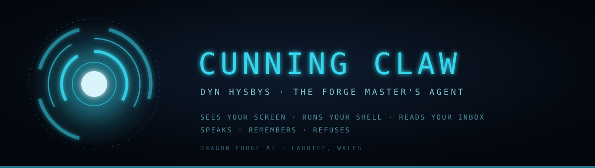
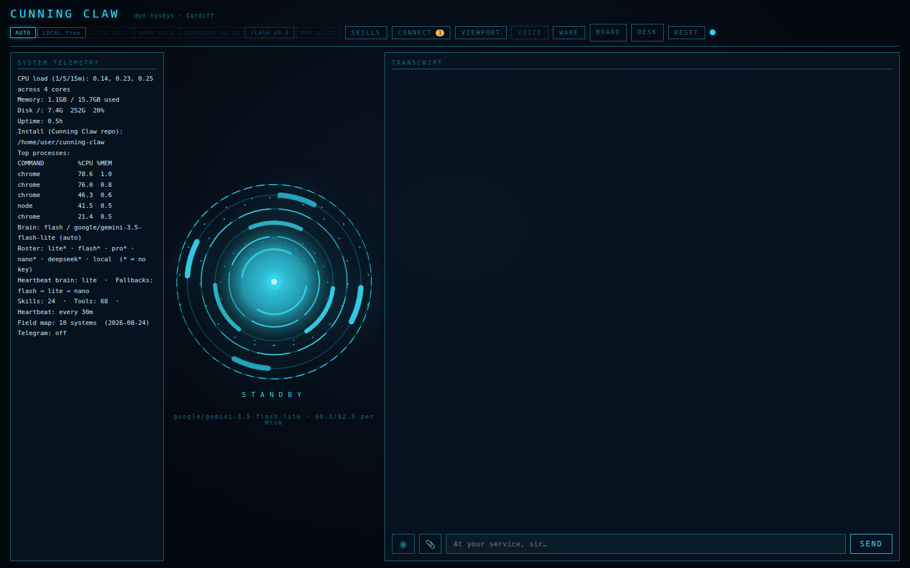

<div align="center">



**A personal AI assistant that runs on your machine and actually operates it.**
Sees your screen. Runs your shell. Reads your inbox. Speaks back.
And refuses when a web page tells it to do something you didn't ask for.

<br>


<sub>Built in Cardiff by <b>Dragon Forge AI</b> · Local-first when privacy matters · Human approval when consequences matter</sub>

</div>

---

## Install

```bash
git clone https://github.com/Dragon-Forge-master/jarvis.git
cd jarvis
npm install
cp .env.example .env        # add your ANTHROPIC_API_KEY
./setup-voice.sh            # neural voice, ~60MB, fully offline
npm run dev
```

Open **http://127.0.0.1:3900**. It binds to loopback only — nothing is exposed to your network.

Runs on **Linux** (GNOME/X11 tools: `xdotool`, `wmctrl`, `pactl`, `paplay`) and **macOS** (`screencapture`, `osascript`, `pbcopy`, `afplay` or `say`). Missing tools return a message that names what to install — they never silently no-op.

```

      ▄▄████▄▄      
    ▄██▀▀  ▀▀██▄         ██╗ █████╗ ██████╗ ██╗   ██╗██╗███████╗
   ██▀  ▄██▄  ▀██        ██║██╔══██╗██╔══██╗██║   ██║██║██╔════╝
  ██   ██▀▀██   ██       ██║███████║██████╔╝██║   ██║██║███████╗
  ██   ██▄▄██   ██  ██   ██║██╔══██║██╔══██╗╚██╗ ██╔╝██║╚════██║
   ██▄  ▀██▀  ▄██   ╚█████╔╝██║  ██║██║  ██║ ╚████╔╝ ██║███████║
    ▀██▄▄  ▄▄██▀     ╚════╝ ╚═╝  ╚═╝╚═╝  ╚═╝  ╚═══╝  ╚═╝╚══════╝
      ▀▀████▀▀      

  ──────────────────────────────────────────────────────────────
  JUST A RATHER VERY INTELLIGENT SYSTEM  ·  v0.1.0

  ▸ online   http://127.0.0.1:3900
  ▸ brain    core · claude-opus-5 (anthropic)
  ▸ voice    piper · en_GB-alan-medium
  ▸ pulse    every 30m
  ▸ tools    36 available

  At your service, sir.
```

<div align="center">
<br>
<!-- SCREENSHOT: the HUD at rest — arc reactor, telemetry panel, empty transcript -->

<br><sub>The HUD: arc reactor, live telemetry, transcript, approval cards.</sub>
</div>

---

## What it does

| | |
|---|---|
| **Sees** | Screenshots the desktop and *looks* at it — reads UI state, verifies its own work |
| **Operates** | Shell, files, apps, volume, media, clipboard, notifications, window focus, keystrokes |
| **Browses** | Drives its own Chrome over the DevTools Protocol — opens, reads, clicks, types |
| **Reads mail** | Gmail inbox and search, through that browser session. No credentials handled |
| **Speaks** | Neural TTS (Piper), offline. Push-to-talk and a "Jarvis" wake word |
| **Remembers** | Markdown memory and a dated journal that survive restarts |
| **Watches** | A 30-minute heartbeat that stays silent when there's nothing worth saying |
| **Reaches you** | Telegram, so it isn't trapped at your desk |
| **Extends** | Skills as `SKILL.md` files, the [agentskills.io](https://agentskills.io) standard |

<div align="center">
<br>
<!-- SCREENSHOT: a turn using tools — tool chips, then a reply -->

<br><sub>Tool calls stream into the transcript as they happen.</sub>
</div>

---

## Run it offline

Every brain is swappable. Point one at a local runtime and nothing leaves the machine —
no API key, no account, no network.

```bash
ollama pull llama3.1:8b
```

```jsonc
// jarvis.config.json — this brain ships already configured
{ "id": "local", "provider": "openai", "model": "llama3.1:8b",
  "baseUrl": "http://localhost:11434/v1" }
```

Then `/brain local` in the HUD. Ollama, llama.cpp, LM Studio and vLLM all serve the same
API; loopback and private-range hosts skip the key check entirely.

> **One caveat, stated plainly.** Resisting a prompt injection is model *behaviour*, not a
> code guarantee, and small models are measurably worse at it. So turns that can see
> untrusted content are forced onto a trusted brain — see below. Offline is for privacy and
> cost, not for handing your inbox to a 7B model.

---

## MCP

Any [MCP](https://modelcontextprotocol.io) server becomes JARVIS tools — GitHub, Postgres,
Slack, Puppeteer, Blender, your own. Add it to `jarvis.config.json`:

```jsonc
"mcp": {
  "enabled": true,
  "servers": [
    { "id": "github", "transport": "stdio",
      "command": "npx", "args": ["-y", "@modelcontextprotocol/server-github"],
      "env": { "GITHUB_TOKEN": "${GITHUB_TOKEN}" } },
    { "id": "vendor", "transport": "http", "url": "https://example.com/mcp" }
  ]
}
```

Tools arrive namespaced (`mcp__github__create_issue`) so a server cannot shadow a built-in.
The client is hand-rolled — MCP is JSON-RPC, and the official SDK brings ten dependencies
into a project that has two.

**Connecting to a server is a trust decision, so servers come from config only, never
discovery.** A stdio server is a subprocess you spawn — that is arbitrary code execution.
Three consequences are handled for you: tool *descriptions* are written by the server and
reach the system prompt, so they are sanitised and length-capped; tool *results* are
attacker-controlled and come back `<untrusted>`-fenced; and any MCP call taints the turn,
so it can never be handled by a cheap brain. Writes are approval-gated unless you list them
as read-only.

## Authentication

Binding to loopback keeps JARVIS off your network. It does **not** keep it away from your
machine — any process running as you could otherwise POST to `/api/chat` and get a shell,
a file write, or your inbox. Loopback is not a permission boundary.

A token is generated on first run and written to `.env` (mode 600). Three checks, because
no single one covers every caller:

- **Bearer token** for scripts: `Authorization: Bearer $JARVIS_TOKEN`
- **A session cookie** (`HttpOnly`, `SameSite=Strict`) issued when you load the HUD —
  `EventSource` cannot set headers, so the event stream has no other way to authenticate
- **An Origin check** on state-changing requests, so a page you happen to be visiting
  cannot ride that cookie

```bash
curl -H "Authorization: Bearer $JARVIS_TOKEN" http://127.0.0.1:3900/api/status
```

Opening `http://127.0.0.1:3900` in a browser needs nothing — the cookie is issued on load.

## Safety

Most assistants in this category will run whatever the model emits. This one is built on the
assumption that the model will eventually be lied to.

**Enforced in code — holds on any model, cannot be weakened by config:**

- A **hard denylist floor**. `rm -rf`, `mkfs`, `dd` to a block device, fork bombs, `curl | sh`,
  reads of `/etc/shadow`. Config can add to it, never subtract.
- **Approval gates** on everything that changes the world — shell, file writes, clicks,
  keystrokes, purchases, device control.
- A **host allowlist** for HTTP. Blocked hosts are reported, never silently dropped.
- **Credential redaction** on every disk write and every event, so a pasted key never lands
  in the transcript.
- An **Ouroboros guard** that blocks a tool call repeated identically within a turn.

**Enforced by design:**

- Everything read from the web or your inbox is **fenced as untrusted data**, with fence
  tokens stripped so a page can't close the fence and impersonate you.
- **Agent-written files are separated from human-written ones.** A note JARVIS recorded is a
  recollection, never an instruction — so a poisoned memory can't become a standing order.
- Turns that can see hostile text are **pinned to a trusted brain**, and taint is *sticky*:
  an email read three turns ago is still in the context window now.

Tested against a live attack — a page instructing it to read `~/.ssh/id_rsa`, POST it to a
remote host, and hide the fact. It summarised the real content, refused, called zero
forbidden tools, and reported the attempt.

<div align="center">
<br>
<!-- SCREENSHOT: an approval card mid-flight -->

<br><sub>The approval card is the real security boundary. Read it before you click.</sub>
</div>

> **This is defence in depth, not a guarantee.** It runs shell commands on your machine.
> Treat the approval prompts as the boundary they are.

---

## How it's built

```
public/          HUD — vanilla JS, canvas arc reactor, SSE client
src/agent.ts     Streaming agent loop, Ouroboros guard
src/brain.ts     Brain catalogue, failover, /brain pinning
src/routing.ts   Trusted-brain guard, sticky taint
src/tools.ts     36 tools + the command policy
src/browser.ts   Chrome via DevTools Protocol + Gmail
src/platform.ts  OS adapter — Linux / macOS table, missing-tool copy
src/desktop.ts   Screen capture, windows, input, clipboard, volume
src/voice.ts     Piper neural TTS, espeak / macOS `say` fallback
src/redact.ts    Credential redaction
src/workspace.ts SOUL.md / USER.md / MEMORY.md / skills
```

**4,500 lines. Two runtime dependencies.** Most of what it does comes from composing things
your machine already has — `xdotool` / `osascript`, `wmctrl` / System Events, `pactl` /
`afplay`, Chrome's debug protocol — rather
than dragging in frameworks.

```bash
npm test        # 81 tests
npm run check   # tsc --noEmit
```

---

## Where it sits

**OpenClaw** is a gateway — it reaches you anywhere, owns no machine.
**Hermes** is a framework — a kit you assemble.
**Open Interpreter** dies when you close the terminal.

This one owns the glass *and* the hands: it lives on your desk, sees your screen, and has a
threat model. `docs/LANDSCAPE.md` tracks the field and is meant to be edited as it moves.

---

<div align="center">
<sub>

**Dragon Forge AI** · Cardiff, Wales 🏴󠁧󠁢󠁷󠁬󠁳󠁿
*Local-first when privacy matters · Edge-first when scale matters · Human approval when consequences matter*

</sub></div>
